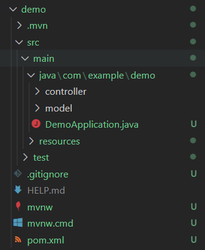
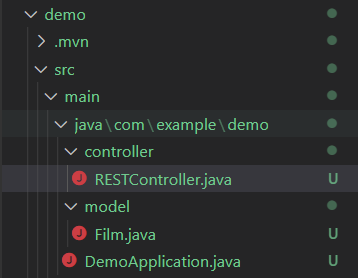
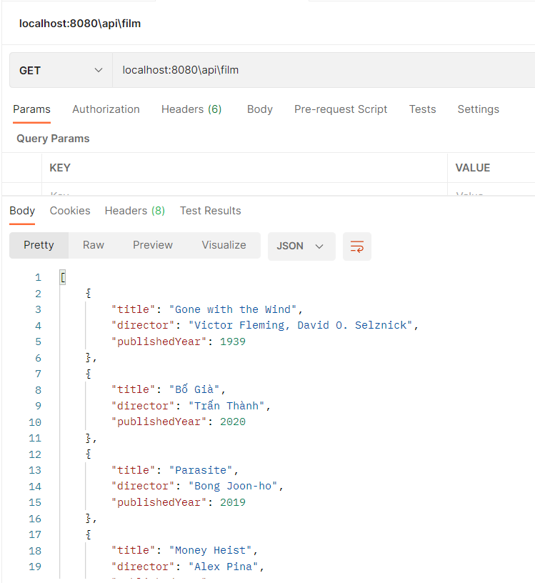
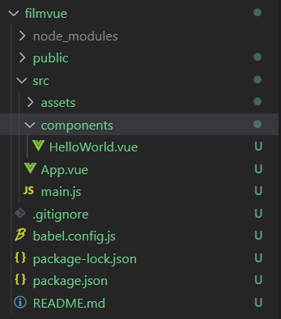

# Bài 2: Java collection

Trong thư mục `javacollection/src`

# Bài 1: Client Side Rendering with Vue JS

**1. Bước 1: khởi tạo project SpringBoot qua Maven**

- Khởi tạo thông qua Spring Initializer


- Chọn version 2.5.4
- Chọn java
- Ở groupID: thay đổi hoặc để nguyên
- ArtifactID: thay đổi hoặc để nguyên (ảnh hưởng tới tên folder springBoot)
- Chọn jar
- Version: chọn bản 16
- Chọn các dependency
  - Spring Web
  - Spring Boot DevTools


**2. Bước 2: Tạo class film và RESTController**

(nếu không thay đổi ArtifactID thì tên folder chứa project sẽ là demo)

- Trỏ vào thư mục demo trong thư mục main


- Tạo thêm 2 thư mục mới là model và controller cho tiện quản lý



- Tạo class Film trong thư mục model.

- Tiến hành khai báo package và class Film với 3 trường `title`, `director`, và `publishedYear`. Khai báo getter, setter, constructor chứa đầy đủ 3 trường

- Tạo class RESTController trong thư mục controller



- Tiến hành import class Film (nếu để mặc định thì đường import sẽ là `com.example.demo.model.Film` )

- Lần lượt thêm các annotation `@RestController`,
  `@CrossOrigin` và `@RequestMapping("/api")`. Ghi nhớ đường dẫn trong ngoặc của `@RequestMapping`

- Thêm method ListFilm cho class RESTController. Lưu ý đường dẫn trong ngoặc của `@GetMapping`

```java
    @GetMapping("/film")
    public ResponseEntity<List<Film>> listFilm() {
        List<Film> films = List.of(new Film("Gone with the Wind", "Victor Fleming, David O. Selznick", 1939),
                new Film("Bố Già", "Trấn Thành", 2020), new Film("Parasite", "Bong Joon-ho", 2019),
                new Film("Money Heist", "Alex Pina", 2018));
        return ResponseEntity.ok().body(films);
    }
```

- Kiểm tra port ở file `application.properties`. Có thể đổi cổng port theo ý thích:

- Tiến hành chạy file `DemoApplication.java`

- Kiểm tra xem API đã có kết quả chưa qua PostMan. Cú pháp của đường dẫn API:

```
localhost: + port + link_RequestMapping + link_GetMapping

Ví dụ trong trường hợp này: localhost:8080/api/film
```

Nếu đã thấy kết quả API thì đã thiết lập xong



**Bước 3: Tạo project VueJs**

- Vào terminal của VScode để tạo project VueJS
  (ở đây sẽ đặt tên project là filmvue)


- Chọn Vue3, đợi chương trình cài đặt

- Cài đặt xong, chuyển thư mục vào địa chỉ mới cài đặt (trong trường hợp này, gõ lệnh `cd filmvue`)

- Cài đặt axios: `npm install axios`

- Thư mục filmvue sau khi cài đặt sẽ trông như sau



- Thêm file `FilmList.vue` vào thư mục components. Nội dung của file:

```javascript
<template>
  <ul id="array-rendering">
    <li v-for="(film, index) in films" :key="index" :film="film">
      {{
        '"' +
        film.title +
        ' - "' +
        film.director +
        '"' +
        " - " +
        film.publishedYear
      }}
    </li>
  </ul>
</template>

<script>
export default {
  props: {
    films: {
      type: Array,
      required: true,
    },
  },
};
</script>

<style scoped>
a {
  color: #42b983;
}
</style>
```

- Sửa các nội dung sau trong file `App.vue`
  - Trong thẻ template
  ```javascript
  <div>
    <h1>Film List</h1>
    <FilmList :films="films" />
  </div>
  ```
  - Trong thẻ script
  ```javascript
  import FilmList from "./components/FilmList.vue";
  import axios from "axios";
  export default {
    components: {
      FilmList,
    },
    data() {
      return {
        films: [],
        loading: false,
        error: null,
      };
    },
    methods: {
      async fetchFilms() {
        try {
          this.error = null;
          this.loading = true;
          const url = `http://localhost:8080/api/film`;
          const response = await axios.get(url);
          this.films = response.data;
        } catch (err) {
          console.log(err);
        }
        this.loading = false;
      },
    },
    mounted() {
      this.fetchFilms();
    },
  };
  ```

Trong thẻ script, phần quan trọng nhất cần chính xác là

```
const url = `http://localhost:8080/api/film`;
```

Đảm bảo đường link này giống đường link lấy api đã kiểm tra qua Postman

- Chạy server với câu lệnh `npm run serve`. Chạy đường link thông báo trong terminal để mở trang web kết quả


- Tiến hành trang trí, chỉnh sửa lại web trong thẻ `style` ở cuối file `App.vue`
