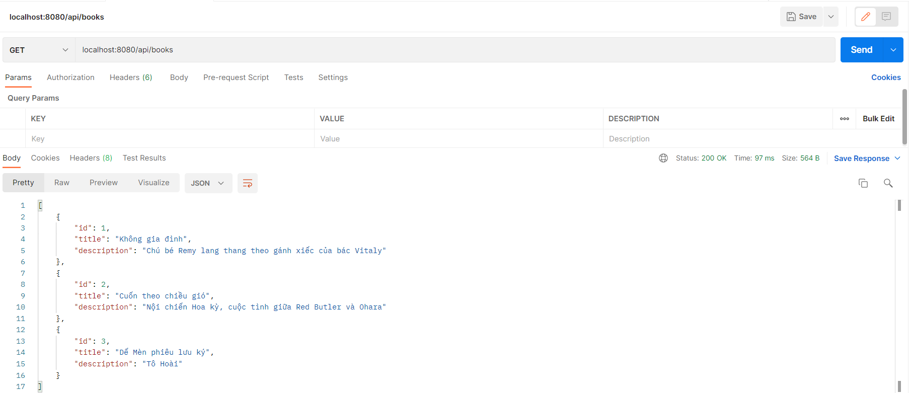
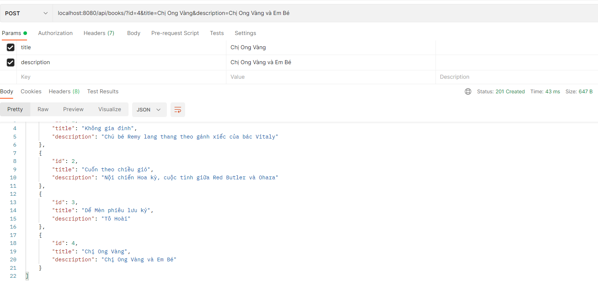
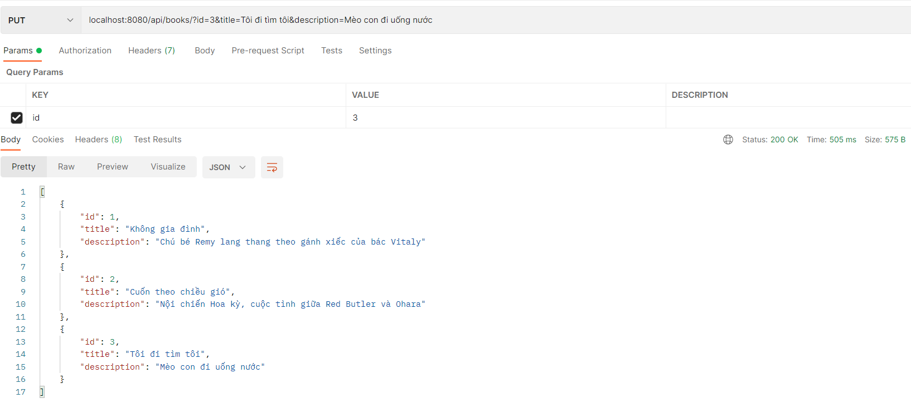

# Get, Post, Put, Delete

- Tạo project SpringBoot mới, sử dụng các dependency sau đây: `DevTools`, `LomBok`, `SpringWeb`, và `Thymeleaf`


- Tạo một class Book chứa các trường `id`, `title`, và `description`. Sử dụng các annotation
  `@Getter`, `Setter`, `@AllArgsConstructor` và `@NoArgsConstructor`

```java
@Getter
@Setter
@AllArgsConstructor
@NoArgsConstructor
public class Book {
    int id;
    String title;
    String description;
}
```

- Chuẩn bị một class service có đánh dấu annotation `@Service` để xử lý business logic trước khi trả về kết quả

  - Để tuân theo Independency Injection, ta nên cho class này implements một interface có đấy đủ các method cần thiết

    ```java
    @Service
    public class BookDAO extends DAO<Book> {}
    ```

- Có thể thêm các dữ liệu ban đầu trong class service như sau

```java
    public BookDAO() {
        listObject.add(new Book(1, "Không gia đình", "Chú bé Remy lang thang theo gánh xiếc của bác Vitaly"));
        listObject.add(new Book(2, "Cuốn theo chiều gió", "Nội chiến Hoa kỳ, cuộc tình giữa Red Butler và Ohara"));
        listObject.add(new Book(3, "Dế Mèn phiêu lưu ký", "Tô Hoài"));
    }
```

- Ta cần chuẩn bị một class controller có đánh dấu annotation là `@RestController`

  - Nếu cần thiết có thể thêm annotation `@RequestMapping("")` để tạo riêng đường dẫn url phân biệt cho API
  - Tiến hành thêm vào bean service thông qua `@Autowired` bằng interface

    ```java
    @RestController
    @RequestMapping("/api/books")
    public class RESTController {
        @Autowired
        private DAO<Book> bookDAO;
    }
    ```

## Lệnh GET

- Trong class Controller

```java
    @GetMapping("")
    public ResponseEntity<List<Book>> getListBook() {
        List<Book> listBook = bookDAO.getall();
        return ResponseEntity.status(HttpStatus.OK).body(listBook);
    }
```

- Trong class Service

```java
    @Override
    public List<Book> getall() {
        return listObject;
    }
```

- Kết quả trên PostMan



## Lệnh GET theo id

- Trong class Controller

```java
    @GetMapping("/{id}")
    public ResponseEntity<Book> getBook(@PathVariable int id) {
        Optional<Book> bookOptional = bookDAO.get(id);
        Book book = null;
        if (bookOptional.isPresent()) {
            book = bookOptional.get();
        }
        return ResponseEntity.ok().body(book);
    }
```

- Trong class Service

```java
    @Override
    public Optional<Book> get(int id) {
        return listObject.stream().filter(p -> (p.getId() == id)).findFirst();
    }
```

- Kết quả trên Postman


## Lệnh POST

- Trong class Controller

```java
    @PostMapping("")
    public ResponseEntity<List<Book>> createBook(@RequestParam int id, @RequestParam String title,
            @RequestParam String description) {
        Book newBook = new Book(id, title, description);
        bookDAO.add(newBook);
        List<Book> listBook = bookDAO.getall();
        return ResponseEntity.status(HttpStatus.CREATED).body(listBook);
    }
```

- Trong class Service

```java
    @Override
    public void add(Book t) {
        listObject.add(t);
    }
```

- Kết quả trên Postman



## Lệnh PUT

- Trong class Controller

```java
    @PutMapping("")
    public ResponseEntity<List<Book>> updateBook(@RequestParam int id, @RequestParam String title,
            @RequestParam String description) {
        Book newBook = new Book(id, title, description);
        bookDAO.update(newBook);
        List<Book> listBook = bookDAO.getall();
        return ResponseEntity.status(HttpStatus.OK).body(listBook);
    }

```

- Trong class Service

```java
    @Override
    public void update(Book t) {
        Optional<Book> matchBook = listObject.stream().filter(p -> (p.getId() == t.getId())).findFirst();
        if (matchBook.isPresent()) {
            Book book = matchBook.get();
            int index = listObject.indexOf(book);
            listObject.set(index, t);
        } else {
            listObject.add(t);
        }
    }
```

- Kết quả trên Postman



## Lệnh DELETE

- Trong class Controller

```java
    @DeleteMapping("/{id}")
    public ResponseEntity<List<Book>> deleteBook(@PathVariable int id) {
        bookDAO.deleteByID(id);
        List<Book> listBook = bookDAO.getall();
        return ResponseEntity.status(HttpStatus.OK).body(listBook);
    }
```

- Trong class Service

```java
    @Override
    public void deleteByID(int id) {
        Optional<Book> match = listObject.stream().filter(p -> (p.getId() == id)).findFirst();
        if (match.isPresent()) {
            Book book = match.get();
            listObject.remove(book);
        }
    }
```

- Kết quả trên Postman


